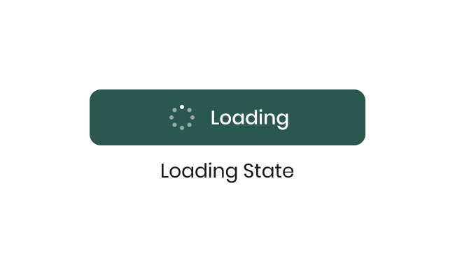
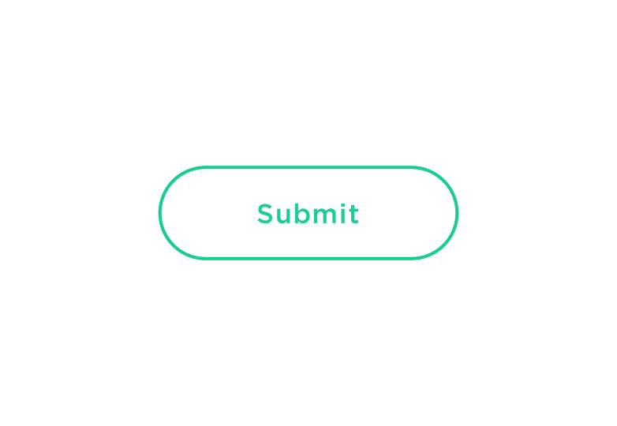

# Enhanced Website

## Client-Side scripting for UX

Over het toepassen van client-side scripting om de User Experience te verbeteren.

### UX

User Experience (UX) is hoe de gebruiker jouw website ervaart, oftewel de gebruikerservaring. Voor een goede gebruikerservaring moet je ervoor zorgen dat een website technisch goed is gebouwd, én een duidelijke en prettige User interface heeft. Zowel de techniek als het design draagt bij aan een goede UX.

Verschillende principes zijn belangrijk voor een goede UX, zoals Toegankelijkheid, Responsiveness, Progressive Enhancement en de Performance van een website. En in de User Interface (UI) zal je ervoor moeten zorgen dat een gebruiker weet wat die kan verwachten, _feedforward_, en of een interactie is gelukt, _feedback_. Dit noemen we ook wel '_states_'. Elke keer als een gebruiker ergens op klikt, of als er data wordt geladen en het succesvol is gelukt, heeft de gebruiker _feedback_ nodig.


### Aanpak
Vandaag ga je eerst bedenken en schetsen hoe je de interactie kan verbeteren met een Loading state en Success state van de UI stack.
Daarna ga je leren hoe je met client-side JS de interface kan enhancen, om de gebruiker goede feedback te geven.


## Enhancement
Om ervoor te zorgen dat jouw website met de POST interactie het altijd doet, bouw je dit eerst in HTML en Server-Side Rendering. 

_Daarna_ kan je de interface verbeteren—“enhancen”—met client-side JavaScript. Stel dat een (oude) browser zonder dat je het weet bepaalde CSS of JavaScript die je gebruikt niet ondersteunt, dan zal deze 'terugvallen' naar een werkende versie, waardoor de core functionaliteit (jouw interactie) altijd werkt, voor iedereen.

### Loading state en Success state

Met behulp van de UI-Stack kan je verschillende states van een pagina ontwerpen als je met dynamische data werkt. De _Empty state_ heb je al, die kan je tonen als er bijvoorbeeld nog geen Berichten zijn toegevoegd. Of als er nog geen Like is gegeven. Of als je een product nog niet tot Favoriet hebt gemaakt. De _Ideal state_ heb je ook; een gevuld hartje, een lijstje met reacties, of een gevuld winkelmandje. 
<!--Een _Loading state_ en _Success state_ komen er in deze stap bij. Of eigenlijk: we gaan de default states die de browser hiervoor biedt _enhancen_.-->

Standaard laat een browser een _loading_ indicator zien terwijl een pagina laadt (vaak in of naast de adresbalk). En als de pagina geladen is, wordt de hele pagina getoond: de _Success state_ (vaak uitgebreid met een extra melding op de pagina). Dat werkt prima, browsers doen dit al jaren, en bezoekers zijn dit gewend.

Maar de volledige pagina verversen als we alleen één Like veranderen, of één reactie toevoegen, of één product aan een winkelmandje toevoegen, dat is wat overdreven. Het werkt overal, maar in veel browsers kunnen we dit prettiger maken voor onze eindgebruikers. 

We kunnen de standaard formulier _submit_ van de browser tegenhouden, de formuliervelden uit het formulier met client-side JS versturen, en met het antwoord van de server _iets doen_. Hoe precies gaan we verderop in deze workshop leren, maar we moeten ons eerst bewust worden van de extra verantwoordelijkheid die we hiermee krijgen. Als we de _default_ Loading en Success states van de browser niet gebruiken, moeten we hiervoor een alternatief ontwerpen _en_ bouwen.

Op het moment dat een gebruiker op een knop klikt en er data naar de server wordt verstuurd, kun je een _Loading state_ tonen. Door het tonen van een loading state weet de gebruiker dat er iets gebeurt:



Als het versturen van de data gelukt is, en de browser heeft antwoord gekregen van de server, kun je feedback tonen met een _Success state_. Door het tonen van een success state weet een gebruiker dat het versturen van data is gelukt:



#### 👉 Loading states en Success states onderzoeken

Zoek met je tafel verschillende voorbeelden van loading states en success states. Gebruik bijvoorbeeld [Codepen](https://codepen.io/) ter inspiratie, waarop je ook kunt zoeken.

Post in Teams mooie voorbeelden van Loading states en Success states.

#### 👉 Jouw ontwerp uitbreiden met states

<!--Schets de Wireflow van jouw interactie, als je dat nog niet gedaan hebt in [de eerste week](https://github.com/fdnd-task/the-web-is-for-everyone-interactive-functionality/blob/main/docs/user-generated-content.md#wireflow-breakdown-met-urls-routes-en-post). Toon eerst de *Ideal state*, de flow dat alles goed gaat, en de *e*mpty state*, voor als er nog niets is. -->

Bedenk hoe je het ontwerp van jouw interactie kunt uitbreiden met deze twee nieuwe states.  Voeg een *Loading state* en *Success state* toe aan je wireflow in Figma. Ontwerp hoe je de gebruiker goede feedback kan geven als er data wordt verstuurd en geladen, en wat je kan tonen als dit gelukt is. Bijvoorbeeld met een animatie op de Like, of een highlight op een nieuw bericht, zorg ervoor dat de gebruiker weet dat de interactie is gelukt.
<!--Gebruik hiervoor [de states van de UI-Stack](https://github.com/fdnd-task/the-web-is-for-everyone-interactive-functionality/blob/main/docs/ui-states.md): Empty state, Loading state en Success state.--> 

Voeg deze nieuwe states toe aan het issue waarin je aan het werk bent.

## Server-side vs. Client-side

In Semester 2 leer je over zowel de server (NodeJS/Express) als de client (de browser). Deze “praten” met elkaar via HTTP en URLs. Een client kan bij een server data ophalen via een `GET` method, en data versturen via een `POST` method.

<!-- Server-side weet je precies welke programmeertaal (NodeJS), packages (Express, Liquid) en hardware (via Render bijvoorbeeld) je tot je beschikking hebt. Client-side weet je dat niet; je weet nooit welke browser (versie) of welk apparaat je website bezoekt.  -->

### Client-side Fetch

Server-side heb je in NodeJS al gewerkt met `fetch()`, om data op te halen uit en op te slaan in Directus. Via `fetch()` kun je HTTP requests uitvoeren: `GET`, `POST`, `DELETE`, etc. Fetch is een _standaard_. Client-side heb je in de meeste browsers met JavaScript ook beschikking over `fetch()`. Alles wat je hierover geleerd hebt de afgelopen weken, werkt dus ook in veel browsers.

Weet je wat dit betekent? De JS code die je in NodeJS hebt geschreven, kun je vrijwel één-op-één in browsers gebruiken. 🤯 Probeer deze code maar eens in je browser Console:

```javascript
const teamResponse = await fetch('https://fdnd.directus.app/items/person/?fields=team&filter[team][_neq]=null&sort=team&groupBy=team')
const teamResponseJSON = await teamResponse.json()
console.log(teamResponseJSON)
```

👉 Probeer een paar van je eigen server-side fetches naar Directus uit in je browser Console, en `console.log()` de resultaten.

Vet hè?

We kunnen een `fetch()` in onze client-side JS gebruiken om een `POST` te doen naar onze eigen Express server. Naar de routes die je al aangemaakt hebt voor het server-side verwerken van de `POST`. 

💡 Je kunt niet zomaar naar elke andere website een `fetch()` doen vanuit JavaScript in een browser. Daarvoor is dit te krachtig. Standaard werkt dit alleen voor URLs van hetzelfde _origin_ (domein). Als websites dit wel toe willen staan, moeten ze dit expliciet aangeven, via zogenaamde _Cross-Origin Resource Sharing (CORS) headers_. Directus laat dit bijvoorbeeld wel toe, waardoor bovenstaand voorbeeld werkt.

### Client-side Fetch ontwerpen

👉 Onderzoek onderstaand code voorbeeld, lees de code comments en gebruik dit om een breakdown van jouw interactie te maken. Voeg pseudo-code aan jouw wireflow in Figma toe. Bespreek daarna jouw ontwerp met een andere student. Het schetsen en uitleggen gaat je helpen om de code beter te begrijpen. <!-- 2.4.2 Schetst om gedachten en processen te verkennen en abstracte begrippen over te brengen. -->

👉 Heb je je ontwerp en code uitgelegd? En heb je anderen al geholpen met hun ontwerp? Pas de code aan naar jouw eigen project. Zorg dat je met client-side JS jouw formulier kunt versturen.


```html
<!-- Score form met action naar de route /score -->
<form method="post" action="/score">

    <fieldset>
        <legend>Team A</legend>
        <label>
            <span>Punten:</span>
            <input type="number" name="score_team_1" placeholder="score" value="{{ scores[0].score_team_1 }}">
        </label>
    </fieldset>

    <fieldset>
        <legend>Team B</legend>
        <label>
            <span>Punten:</span>
            <input type="number" name="score_team_2" placeholder="score" value="{{ scores[0].score_team_2 }}">
        </label>
    </fieldset>

    <button type="submit">Save score</button>

</form>

<!-- Scoreverloop, met in de loop de partial score.liquid -->
<section id="score">
    <h2>Scoreverloop</h2>

    <ol>
            
        <li>
            Team A: {{ score.score_team_1 }}        
            <br>Team B: {{ score.score_team_2 }}        
            <br>date: {{ score.date_created | date: '%d-%m-%Y %H:%M' }}
        </li>
    
    </ol>

</section>
```

```javascript
<!-- Client-Side script voor enhancement -->
<!-- type="module" is een feature detection
      browsers die dat ondersteunen, ondersteunen ook fetch (en andere js methoden) 
      https://snugug.com/musings/modern-cutting-the-mustard/
-->
<script type="module"> 

  const scoreForm = document.querySelector("form")
  const formButton = document.querySelector("form button")
  const scores = document.querySelector("#score ol")

  // Als er op de submit button wordt geklikt ...
  scoreForm.addEventListener("submit", async function(event) {
    // Voorkom de standaard submit van de browser
    // Let op: hiermee overschrijven we de default Loading state van de browser...
    event.preventDefault()
    
    //Loading state tonen:
    formButton.classList.add("loading")
    formButton.textContent = "loading..."

    //formdata voorbereiden:
    let formData = new FormData(scoreForm);    

    // Data fetchen:
    // Doe een fetch naar de server, net als hoe de browser dit normaal zou doen
    // Gebruik daarvoor het action en method attribuut van het formulier
    // Stuur de formulierelementen mee
    const response = await fetch(scoreForm.action, {
      method: scoreForm.method, //POST dus
      body: new URLSearchParams(formData) // <<< Dit moet omdat server.js anders niet met de formulier data kan werken
    })

    // Data verwerken:
    // Jouw server.js geeft data terug als het posten goed gaat
    const responseData = await response.text()

    // Normaal zou de browser die HTML parsen en weergeven.
    // Maar omdat we dit nu in client-side JS doen moeten we dit zelf doen:
    // Parse de nieuwe HTML en maak onderwater een nieuw Document Object Model aan
    const parser = new DOMParser()
    const responseDOM = parser.parseFromString(responseData, 'text/html')

    // Zoek in de onderwater DOM de nieuwe state op
    const newState = responseDOM.querySelector('#score ol')

    // Overschrijf de HTML met de nieuwe HTML
    // We gaan de nieuwe state toevoegen aan de DOM, aan de scorelijst in de ol
    scores.innerHTML = newState.innerHTML

    // Loading state weghalen
    // Nu kan je waarschijnlijk de Loading state vervangen door een Success state
    console.log("Loading state weghalen")
    formButton.classList.remove("loading")
    formButton.textContent = "Save score"

  })

</script>

```


<details>
    <summary>Voorbeeld code voor meerdere Like buttons op een pagina</summary>

```html


  <!-- Ideal state -->
  <form method="POST" action="/detail/{{ id }}/unlike" data-enhanced="formulier-{{ id }}">
    <button type="submit">Unlike</button>
  </form>

  <!-- Empty state -->
  <form method="POST" action="/detail/{{ id }}/like" data-enhanced="formulier-{{ id }}">
    <button type="submit">Like</button>
  </form>


<script type="module">

  // Als er ergens op de pagina een formulier wordt gesubmit..
  // (We maken hier gebruik van Event Delegation)
  document.addEventListener('submit', async function(event) {

    // Hou in een variabele bij welk formulier dat was
    const form = event.target

    // Als dit formulier geen data-enhanced attribuut heeft, doe dan niks speciaals (laat het formulier normaal versturen)
    // Dit doen we, zodat we sommige formulieren op de pagina kunnen 'enhancen'
    // Door ze bijvoorbeeld data-enhanced="true" of data-enhanced="formulier-3" te geven.
    // Data attributen mag je zelf verzinnen: https://developer.mozilla.org/en-US/docs/Learn_web_development/Howto/Solve_HTML_problems/Use_data_attributes
    if (!form.hasAttribute('data-enhanced')) {
      return
    }

    // Voorkom de standaard submit van de browser
    // Let op: hiermee overschrijven we de default Loading state van de browser...
    event.preventDefault()

    // Verzamel alle formuliervelden van het formulier
    let formData = new FormData(form)

    // En voeg eventueel de name en value van de submit button toe aan die data
    // https://developer.mozilla.org/en-US/docs/Web/API/SubmitEvent/submitter
    if (event.submitter) {
      formData.append(event.submitter.name, event.submitter.value)
    }

    // Doe een fetch naar de server, net als hoe de browser dit normaal zou doen
    // Gebruik daarvoor het action en method attribuut van het originele formulier
    // Inclusief alle formuliervelden
    const response = await fetch(form.action, {
      method: form.method,
      body: new URLSearchParams(formData)
    })

    // De server redirect op de normale manier, en geeft HTML terug
    // (De server weet niet eens dat deze fetch via client-side JavaScript gebeurde)
    const responseText = await response.text()

    // Normaal zou de browser die HTML parsen en weergeven, maar daar moeten we nu zelf iets mee
    // Parse de nieuwe HTML en maak onderwater een nieuw Document Object Model aan
    const parser = new DOMParser()
    const responseDOM = parser.parseFromString(responseText, 'text/html')

    // Zoek in de onderwater DOM de nieuwe UI state op
    // We gebruiken hiervoor het eerdere data-enhanced attribuut, zodat we weten waar we naar moeten zoeken
    // In de nieuwe HTML zoeken we bijvoorbeeld naar data-enhanced="true" of data-enhanced="formulier-3"
    // (Hierdoor kunnen we ook meerdere formulieren op dezelfde pagina gebruiken)
    const newState = responseDOM.querySelector('[data-enhanced="' + form.getAttribute('data-enhanced') + '"]')

    // Overschrijf ons formulier met de nieuwe HTML
    // Hier wil je waarschijnlijk de Loading state vervangen door een Success state
    form.outerHTML = newState.outerHTML

  })

</script>

```

</details> 


#### Bronnen

- [Using the Fetch API @ MDN](https://developer.mozilla.org/en-US/docs/Web/API/Fetch_API/Using_Fetch)
<!-- - [Using data attributes @ MDN](https://developer.mozilla.org/en-US/docs/Learn_web_development/Howto/Solve_HTML_problems/Use_data_attributes) -->
- [Retrieving a FormData object from an HTML form @ MDN](https://developer.mozilla.org/en-US/docs/Web/API/XMLHttpRequest_API/Using_FormData_Objects#retrieving_a_formdata_object_from_an_html_form)
<!-- - [Fetch Standard @ WHATWG](https://fetch.spec.whatwg.org/) -->
- [Cross-Origin Resource Sharing (CORS) @ MDN](https://developer.mozilla.org/en-US/docs/Web/HTTP/Guides/CORS) (geavanceerd)

### Extra states toevoegen

👉 Breid bovenstaande JavaScript code uit met een Loading state en Success state, zoals je hebt ontworpen. Gebruik hiervoor de technieken die je in Sprint 5 hebt geleerd, zoals de `classList`.

💪 De View Transition API leent zich erg goed voor deze enhancement, met name voor de Success state. Onderzoek hoe je deze met Progressive Enhancement in kunt zetten in bovenstaande code. Hou rekening met ondersteuning in verschillende browsers.

#### Bronnen

- [Using the View Transition API @ MDN](https://developer.mozilla.org/en-US/docs/Web/API/View_Transition_API/Using)
- [Smooth transitions with the View Transition API](https://developer.chrome.com/docs/web-platform/view-transitions/)

<!--
- [View Transitions @ 12 Days of Web](https://12daysofweb.dev/2023/view-transitions/)
- Bekijk de view transitions op [de website van Dave Rupert](https://daverupert.com/)
- [Getting started with View Transitions on multi-page apps](https://daverupert.com/2023/05/getting-started-view-transitions/)

-->


<!--
### Aanpak
Deze workshop gaan we met behulp van de _View Transition API_ feedback geven aan de gebruiker als het posten en laden van data is gelukt. Maar eerst gaan we onderzoeken wat _View Transitions_ zijn en wat je er zoal mee kan.

Daarna ga je leren hoe je met client-side JavaScript data kan posten, om de gebruiker goede feedback te geven.

## View Transition API

Met de _View Transition API_ kan je tussen verschillende _views_, oftewel states, animeren. Voorheen was hier veel JavaScript en CSS voor nodig, maar sinds een paar jaar kunnen moderne browsers dit voor jou doen.
Het is een mooie techniek om bijvoorbeeld de resultaten van een filter en sorteer actie te tonen, of de success state van het posten van een bericht te animeren. Of om een overgang tussen twee pagina's te animeren. Met goede states verbeter je de uX van je website, en een website kan hierdoor sneller aanvoelen.

Hieronder staat een voorbeeld van en *View transition* tussen twee verschillende pagina's.  
(Bron: [Getting started with View Transitions on multi-page apps](https://daverupert.com/2023/05/getting-started-view-transitions/))

<video src="https://github.com/user-attachments/assets/e57ac40e-df8a-4c4a-9c63-84bb47076136" controls></video>


### Hoe werken view transitions in de browser?
Voor elke _View Transition_ maakt de browser een _snapshot_ (een plaatje) van de oude én de nieuwe state. Met CSS kun je bepalen hoe de transition tussen beide snapshots er uit komt te zien. Standaard animeert een browser alleen de `opacity` tussen beide snapshots, waardoor je een _cross-fade_ krijgt. Maar je kunt vrijwel alles aanpassen. Als je weet hoe je keyframe animaties gebruikt in CSS, weet je eigenlijk ook al hoe je View Transitions kunt aanpassen.

Niet elke browser ondersteunt deze nieuwe standaard, maar dit is een goed voorbeeld van een _Progressive Enhancement_, die je nu al in kunt zetten. Oudere browsers laten gewoon de soepele overgang niet zien.

👉 Bekijk de view transitions op [de website van Dave Rupert](https://daverupert.com/). Maak met je tafel een breakdown van de view transitions op het whiteboard. Gebruik de devtools om de code met animaties te analyseren. 

✌️ Bekijk verschillende voorbeelden van Adam Argyle op Codepen https://codepen.io/collection/GoGOGK. Welke zou jij kunnen toepassen op jouw project?

💪 Bekijk en analyseer de geavanceerde view transition voorbeelden op https://view-transitions.chrome.dev/

### Bronnen

- [Hoe debug en inspecteer je animaties?](https://developer.chrome.com/docs/devtools/css/animations/)
- [Using the View Transition API @ MDN](https://developer.mozilla.org/en-US/docs/Web/API/View_Transition_API/Using)
-->

<!--
## Multi-Page transitions

Met de View Transition API kun je vrij gemakkelijk tussen twee paginabezoeken animeren. Bijvoorbeeld tussen een overzichtspagina en een detailpagina. Dat worden *cross-document view transitions* of *multi-page transitions* genoemd (voor _Multi-Page Apps, MPAs_). Omdat we server-side rendering met dynamische routes gebruiken dit semester, is dit een fijne toevoeging voor de UX.

Als je deze CSS toevoegt aan je stylesheet, werkt het al:

```css
@view-transition {
    navigation: auto;
}
```

Als je verder niks doet, krijg je een cross-fade tussen de `root` snapshots van beide pagina's (de hele viewport), maar met een beetje CSS kun je dit helemaal aanpassen. Met de `view-transition-name` property kun je de browser verschillende snapshots van verschillende elementen laten maken, en die allemaal op een eigen manier laten animeren.

👉 Gebruik het artikel [Getting started with View Transitions on multi-page apps](https://daverupert.com/2023/05/getting-started-view-transitions/) (vanaf Stap 2, Stap 1 is niet relevant meer) en MDN om jouw eigen project met multi-page view transitions uit te breiden. Je hebt hiervoor geen JavaScript nodig.


### Bronnen

- [Een vette demo](https://live-transitions.pages.dev/)
- [Getting started with View Transitions on multi-page apps](https://daverupert.com/2023/05/getting-started-view-transitions/)
-->

<!--
## Single-Page transitions

Je kunt View Transitions ook inzetten om verschillende states op dezelfde pagina (_Single Page Apps, SPAs_) te animeren. Dit is een mooie techniek voor het extra _enhancen_ van bijvoorbeeld de success state van een POST functionaliteit, als je die met een client-side fetch hebt uitgebreid.

<video src="https://github.com/user-attachments/assets/494cb940-dc89-4e53-afcd-8c0ecd54b7f5" controls></video>

*Met View Transitions wordt duidelijke feedback voor het toevoegen en verwijderen van cards getoond - <a href="https://developer.chrome.com/docs/web-platform/view-transitions/">Smooth transitions with the View Transition API</a>*

Voorheen kon je dit doen met duizenden regels JavaScript en CSS, maar met _View Transitions_ kun je de browser het zware werk laten doen. Je hebt hiervoor één regel JavaScript nodig:

```js
document.startViewTransition(updateFunction)
```

Hiermee laat je de browser een snapshot van de pagina maken, je update functie uitvoeren, en de view transitions tussen beide states uitvoeren. Hoe die transities precies werken, beschrijf je weer in CSS, precies zoals je bij Multi-Page transitions geleerd hebt.

Je hebt hiervoor alleen wel _feature detection_ nodig. Een browser die deze regel niet kent, zal anders een error geven. Ook hierbij geldt dus: zie een View Transition als Progressive Enhancement. Zonder deze feature kun je nog steeds prima gebruik maken van jouw site, maar mét deze feature kan het net even wat beter.

```js
if (document.startViewTransition) {
    document.startViewTransition(function() {
        // Verander hier iets in de DOM
    })
} else {
    // Verander hier iets in de DOM
}
```

Het [script dat je in Sprint 9 kreeg](https://github.com/fdnd-task/the-web-is-for-everyone-interactive-functionality/blob/main/docs/client-side-fetch.md#client-side-fetch):

```js
// Overschrijf ons formulier met de nieuwe HTML
// Hier wil je waarschijnlijk de Loading state vervangen door een Success state
form.outerHTML = newState.outerHTML
```

Kun je dus uitbreiden met de volgende success state:

```js
// Overschrijf ons formulier met de nieuwe HTML, met of zonder een View Transition, afhankelijk van de browser
if (document.startViewTransition) {
    document.startViewTransition(function() {
        form.outerHTML = newState.outerHTML
    })
} else {
    form.outerHTML = newState.outerHTML
}
```

Ook hierbij krijg je standaard een cross-fade van de browser, die je helemaal aan kunt passen met CSS.

👉 Combineer dit voorbeeld met de bronnen hieronder, en pas met JavaScript en CSS Single-Page view transitions toe in jouw eigen success state. Maak hiervoor een nieuw issue aan, voeg schetsen, breakdowns, een analyse van het probleem en bronnen toe.


### Bronnen

- [Same-document view transitions for single-page applications @ developer.chrome.com](https://developer.chrome.com/docs/web-platform/view-transitions/same-document)
- [View Transition API: Single Page Apps Without a Framework @ DebugBear](https://www.debugbear.com/blog/view-transitions-spa-without-framework)
- [Een veel voorkomend probleem stap voor stap uitgelegd door Jake Archibald](https://jakearchibald.com/2024/view-transitions-handling-aspect-ratio-changes/)
- [A Practical Guide to the CSS View Transition API door onze eigen Cyd Stumpel!](https://cydstumpel.nl/a-practical-guide-to-the-css-view-transition-api/)
-->

<!-- 
- [View Transitions @ 12 Days of Web](https://12daysofweb.dev/2023/view-transitions/)
- [Using the View Transition API @ MDN](https://developer.mozilla.org/en-US/docs/Web/API/View_Transition_API/Using)
- [Smooth transitions with the View Transition API @ developer.chrome.com](https://developer.chrome.com/docs/web-platform/view-transitions/)
-->
